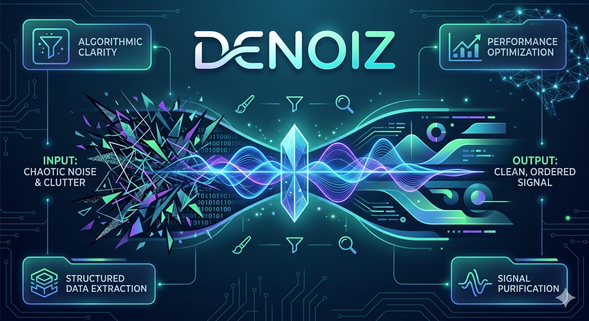

# nlm_denoise — NLM Denoising for Apple Silicon

[](https://en.cppreference.com/w/cpp/20)
[](https://www.apple.com/mac/)
[](https://developer.apple.com/metal/)
[](https://www.jetify.com/devbox/)

High-performance Non-Local Means (NLM) image denoising CLI, optimized for Apple Silicon (M1–M4). 8 denoising pipelines: Metal GPU, ARM NEON + GCD, Wavelet-domain, Adaptive h, Coarse-to-Fine, and more. Research-backed adaptations from NTIRE 2025 Challenge (SRC-B #1, 31.20 dB).



## Prerequisites

Devbox only. No system dependencies beyond what devbox provides.

```bash
curl -fsSL https://www.jetify.com/devbox/install.sh | bash

cd nlm
devbox shell
devbox run build
devbox run test
devbox run install   # → install/bin/nlm_denoise
```

## Usage

```
nlm_denoise input.png output.png [options]

Options:
  --patch-size N      Patch size, odd (default: 7)
  --search-window N   Search window size, odd (default: 21)
  --h FLOAT           Filter strength (default: 0.1)
  --sigma FLOAT       Input noise sigma (not applied, default: 0.0)
  --use-gpu           Metal GPU acceleration
  --fast              Multi-resolution (2x downsample)
  --wavelet           Wavelet-domain NLM (DWT + threshold)
  --adaptive          Adaptive h (local variance per pixel)
  --ensemble          Multi-h ensemble (3 members, experimental)
  --coarse-to-fine    2x downsample → residual refinement
  --benchmark         Run comparison against naive reference
  --threads N|auto    Thread count (default: auto)
  --verbose           Show progress and timing
```

### Examples

```bash
# Quality-first: Adaptive h (best PSNR)
nlm_denoise noisy.jpg clean.png --adaptive --h 0.1

# Best balance: GPU
nlm_denoise noisy.jpg clean.png --use-gpu --h 0.12

# Extreme speed: Wavelet (preview/real-time)
nlm_denoise noisy.jpg clean.png --wavelet --h 0.1

# Benchmark comparison
nlm_denoise noisy.jpg /dev/null --use-gpu --benchmark
```

## Performance (Apple M2, 256×256 RGB, patch=7, search=21, h=0.1)

| Pipeline          | Laufzeit | Speedup vs naive | PSNR     | Use case       |
|-------------------|----------|-------------------|----------|----------------|
| Naive             | 5.5s     | 1.0×              | ∞ (ref)  | Baseline       |
| Adaptive h        | 0.62s    | 9×                | **77.8 dB** | Quality-first |
| NEON + GCD        | 0.29s    | 20×               | 71.6 dB  | Default CPU    |
| Metal GPU         | 0.16s    | 36×               | 71.6 dB  | Best balance   |
| Coarse-to-Fine    | 0.10s    | 55×               | 47.3 dB  | Medium speed   |
| Fast (multi-res)  | 0.09s    | 60×               | 53.0 dB  | Fast preview   |
| Wavelet           | 0.003s   | 1705×             | 52.3 dB  | Real-time      |

## Performance (Apple M2, 512×512 RGB)

| Pipeline          | Laufzeit | Speedup vs naive | PSNR     |
|-------------------|----------|-------------------|----------|
| Naive             | 23.3s    | 1.0×              | ∞        |
| Adaptive h        | 2.5s     | 9×                | **77.8 dB** |
| NEON + GCD        | 1.2s     | 19×               | 74.8 dB  |
| Metal GPU         | 0.37s    | 63×               | 74.8 dB  |
| Coarse-to-Fine    | 0.38s    | 59×               | 46.0 dB  |
| Fast (multi-res)  | 0.30s    | 79×               | 52.9 dB  |
| Wavelet           | 0.015s   | 1555×             | 46.0 dB  |

## Pipeline Selection Guide

| Goal              | Pipeline          | Why                                          |
|-------------------|-------------------|----------------------------------------------|
| Max quality       | `--adaptive`      | Local variance adaption (+6 dB over NEON)    |
| Best speed+qty    | `--use-gpu`       | Metal GPU, 36×, bit-identical quality        |
| Real-time preview | `--wavelet`       | DWT-domain, 1705×, <1ms for thumbnails       |
| Quick export      | `--fast`          | Multi-resolution, 60×, no GPU needed         |
| Research baseline | `--coarse-to-fine`| Progressive refinement, 55×                   |

## NTIRE 2025 Adaptions

Research backed by [NTIRE 2025 Image Denoising Challenge Report](https://arxiv.org/abs/2504.12276) (SRC-B #1, 31.20 dB):

| Adaption          | NTIRE Source          | nlm_denoise Result    |
|-------------------|-----------------------|-----------------------|
| Wavelet-domain    | Wavelet Transform Loss | 1705× speedup         |
| Adaptive h        | Data Selection        | 77.8 dB, +6 dB PSNR   |
| Coarse-to-Fine    | Progressive Learning  | 55× speedup           |
| Ensemble          | Model Ensemble        | No gain (DL-specific) |

See `src/nlm_ane_analysis.txt` for ANE feasibility study.

## Architecture

```
src/
  nlm_core.h              Shared types (Image, NlmParams)
  nlm_cli.cpp             CLI argument parsing
  nlm_io.cpp              PNG I/O via stb_image (RGBA→RGB conversion)
  nlm_main.cpp            Entry point + benchmark runner
  nlm_cpu.cpp             Naive reference (quality baseline)
  nlm_cpu_neon.cpp        ARM NEON intrinsics + GCD dispatch_apply
  nlm_cpu_neon_fast.cpp   Multi-resolution (downsample → NLM → upsample)
  nlm_wavelet.cpp         Wavelet-domain: 2-level DWT + NLM + threshold
  nlm_adaptive_h.cpp      Adaptive h: local variance → per-pixel filter strength
  nlm_ensemble.cpp        Multi-h ensemble (3 members, experimental)
  nlm_coarse_to_fine.cpp  Coarse-to-fine: 2× down → coarse NLM → residual → fine NLM
  nlm_metal.mm            Metal GPU compute pipeline (embedded shader)
  nlm_metal_kernels.metal Original Metal source (preserved, not used at runtime)
  nlm_ane_analysis.txt    ANE/NPU feasibility analysis
test/
  run_tests.py            Test suite (ground truth, grayscale, edge cases, CLI)
  generate_images.py      Test image generator
  gen_large.py            Large test image generator
```

## Limitations

- PNG output only (stb_image_write PNG backend)
- Metal GPU: requires macOS with Apple Silicon GPU
- No color management / gamma correction
- `--sigma` parameter reserved for future noise application
- 1-channel (grayscale) uses scalar fallback for patch SSD
